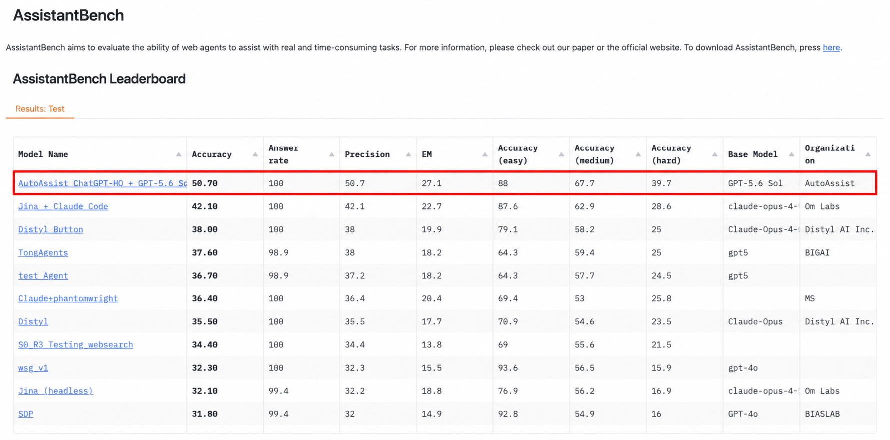
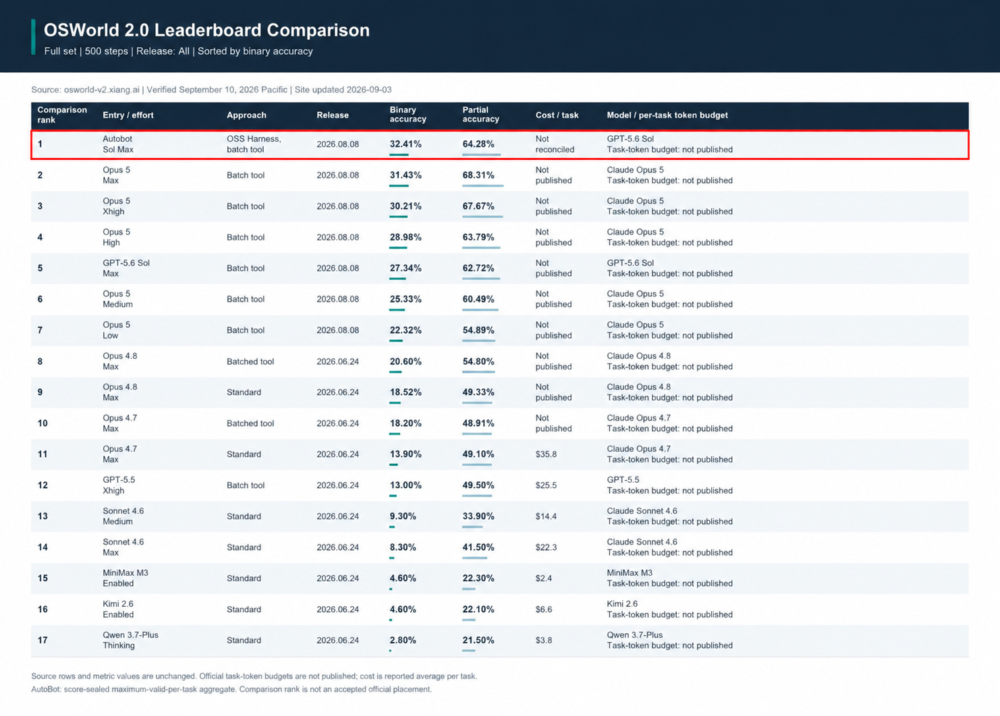

# AutoBot

**AutoBot: a self-improving agentic harness that makes frontier AI better at finishing complex knowledge work.**

AutoBot achieved **18.5% higher task completion than the published OpenAI Sol Max baseline**, surpassing **Anthropic’s Claude Opus 5 Max** on OSWorld 2.0, a benchmark of long, multi-application workflows. It also reached **#1 on the official AssistantBench hidden-test leaderboard**. [Results and methodology](https://github.com/demeyer1/Autobot/tree/main/benchmarks)

**Hard workflows become upgrades to the agent itself.** AutoBot repairs its own harness, independently validates the changes, and carries them forward. The next workflow inherits the improvement. **Compounding capability, without retraining the model.**

**Your knowledge outgrows the context window.** Hierarchical memory lives on disk; task-specific retrieval builds the working context. Nightly consolidation integrates new knowledge and corrections. Your agent accumulates institutional memory across projects and conversations.

**Your project can outlive the agent working on it.** Persistent task graphs, atomic checkpoints and independent supervision let a replacement worker resume the assignment. Completion is bound to current requirements and verified destination evidence.

**Local compute makes persistent intelligence economical.** Your CPU handles orchestration, state and integrity checks. Compiled context and reusable proofs reduce repeated inference, directing the model’s budget toward the difficult judgments that move work forward.

Open source. Native ChatGPT on your Mac. Built by [Autonomous Production](https://autoprod.ai). [Get AutoBot](https://github.com/demeyer1/Autobot/releases).

## Benchmarks

### AssistantBench

**#1 on the recorded official hidden-test leaderboard: 50.70% accuracy across 181 tasks.**

[](benchmarks/assistantbench/)

<sub>AutoAssist was the harness's previous brand name, changed to AutoBot.</sub>

[Results and verification](benchmarks/assistantbench/)

### OSWorld 2.0

**32.41% binary accuracy and 64.28% partial accuracy across 108 tasks.** Final best-valid-per-task aggregate, compared with the published September 10, 2026 leaderboard snapshot.

[](benchmarks/osworld-2.0/)

[Results and methodology](benchmarks/osworld-2.0/)

## What it changes

- **Privacy by relationship and purpose.** Personal, family and friends, work, and deliberately shared context have separate zones. Nothing moves into `SHARED` automatically.
- **Independent completion.** The local runtime rejects validation under the producer label. The operating contract also requires a separate validator to inspect current evidence, including the real destination when the task changes something outside the workspace.
- **Durable follow-through.** Native ChatGPT Goals keep the active work moving. Autobot keeps the objective, stages, evidence, and recovery state on disk so an interrupted chat does not silently erase the commitment.
- **Clean external actions.** Recipient-visible writes use the signed-in first-party app through Computer Use. The operating contract requires the active ChatGPT workflow to verify the account, destination, and visible content before the action, then check the rendered result for a duplicate, failure, or unwanted AI attribution. If the clean route cannot be verified, the workflow must stop.
- **Tone that stays in its lane.** Communication profiles are separated by channel and audience. A family text profile does not become a work email profile. Autobot stores compact, user-approved patterns rather than raw message archives by default.

## What Autobot includes

Autobot is the combination of two layers:

1. **Native ChatGPT:** the desktop app, local Projects, Voice, Goals, skills and plugins, scheduled work, notifications, and Computer Use.
2. **The Autobot workspace:** the operating contract in `AGENTS.md`, privacy zones, selective memory, project status, a local objective state machine, a one-minute liveness supervisor, external-action policy, and first-time setup.

Autobot is not a separate model, chatbot, or agent gateway. It depends on current ChatGPT capabilities and their plan, region, usage, sandbox, and permission limits. See [Architecture](docs/ARCHITECTURE.md) and [Permissions](docs/PERMISSIONS.md).

## Autobot compared with OpenClaw and Hermes

This comparison evaluates Autobot plus native ChatGPT for one person managing personal and work tasks on a Mac. "Better" means a more explicit default for the stated user need, based on the published design; it does not mean a measured advantage in accuracy, speed, or reliability. "Doesn't do" means the specific built-in requirement was not found in the primary documentation reviewed on September 10, 2026. Both alternatives can be extended.

| | Top 3 shared capabilities: Autobot's approach and user benefits | Top 3 additional Autobot capabilities and user benefits |
| --- | --- | --- |
| [**OpenClaw**](https://github.com/openclaw/openclaw) | **1. Remember context with explicit boundaries.** OpenClaw persists and searches memory. Autobot adds default personal, family/friends, work, and opt-in shared zones. This makes the rules for reusing private context in a work task more explicit. [Memory](https://docs.openclaw.ai/concepts/memory) / [Autobot privacy](PRIVACY.md).<br><br>**2. Track the promised outcome.** OpenClaw records background tasks and delivery state. Autobot assigns each promised output an owner, destination, and completion gate. This gives the user a clearer record of what remains owed after an interruption. [Tasks](https://docs.openclaw.ai/automation/tasks) / [Autobot contract](AGENTS.md#projects-and-unfinished-work).<br><br>**3. Check the result of an app action.** OpenClaw supports tools and outbound audit history. Autobot requires account, destination, and content checks before a write, followed by rendered inspection. This adds an explicit check for a wrong destination, failed save, or duplicate action. [Audit](https://docs.openclaw.ai/gateway/audit) / [Autobot writes](AGENTS.md#external-reads-and-writes). | **1. Require a separate completion validator.** Autobot's five-stage process requires current evidence and a validator label different from the producer, with destination readback for external work. This gives users evidence beyond the worker's own success report. [Completion](AGENTS.md#completion-integrity).<br><br>**2. Block writes when clean delivery cannot be verified.** Autobot's default policy requires first-party Computer Use and stops a route that forces unwanted attribution. This gives users an explicit publication rule instead of relying on each connector's behavior. [Write policy](AGENTS.md#external-reads-and-writes).<br><br>**3. Keep learned tone separate by channel and audience.** Autobot requires authorized examples and compact, separate communication profiles. This helps keep a family-text style from shaping a customer email. [Profiles](00_CONTEXT/COMMUNICATION-PROFILES.md). |
| [**Hermes**](https://github.com/NousResearch/hermes-agent) | **1. Remember context with purpose-specific retrieval.** Hermes has curated memory, user profiles, and session search. Autobot makes relationship and purpose part of its default retrieval rules. This gives users clearer control over which personal facts may inform professional work. [Memory](https://hermes-agent.nousresearch.com/docs/user-guide/features/memory) / [Autobot privacy](PRIVACY.md).<br><br>**2. Follow work through to its deliverable.** Hermes schedules jobs and delivers their outputs. Autobot also retains the objective, ordered evidence stages, and unfinished outputs. This makes it easier to distinguish a job that ran from a requested artifact that was saved and checked. [Scheduling](https://hermes-agent.nousresearch.com/docs/user-guide/features/cron) / [Autobot completion](AGENTS.md#completion-integrity).<br><br>**3. Verify user-visible changes.** Hermes provides tool approvals and execution controls. Autobot adds a standard before-and-after inspection of the signed-in destination. This gives the user a specific check that an authorized action produced the intended visible result. [Security](https://hermes-agent.nousresearch.com/docs/user-guide/security) / [Autobot writes](AGENTS.md#external-reads-and-writes). | **1. Require independent acceptance of every completion stage.** Autobot separates the producer and validator labels and requires fresh destination evidence for external outputs. This makes an unsupported "done" report insufficient under the operating contract. [Completion](AGENTS.md#completion-integrity).<br><br>**2. Require a clean first-party write route by default.** Autobot checks the exact account and visible content, then rejects forced-attribution or unverifiable delivery routes. This gives users a consistent rule for communications across services. [Write policy](AGENTS.md#external-reads-and-writes).<br><br>**3. Require audience-specific tone-learning boundaries.** Hermes supports personality and user-style preferences; Autobot specifies separately authorized profiles for each channel and audience. This gives users more explicit control over which examples shape each kind of message. [Hermes memory](https://hermes-agent.nousresearch.com/docs/user-guide/features/memory) / [Autobot profiles](00_CONTEXT/COMMUNICATION-PROFILES.md). |

These are operating-contract differences, not guarantees of error-free execution. Autobot's privacy zones and validator separation are procedural within one Mac; they are not OS isolation or cryptographic identities. OpenClaw and Hermes offer broader standalone deployment, messaging, and model choices. The absence findings above concern the exact required workflows, not an absence of memory, privacy controls, voice, verification tools, or automation in either project.

## What is new in 0.3.0

The project-local first-time skill now acts as the setup operator. It checks current state, applies safe local defaults, runs supported actions, preserves the earliest unresolved user or capability gate, and returns to the user's original task only after current marker and status readback.

The base folder installs without Node or sign-in. The advanced runtime needs Node 22 or newer. Native app capabilities are discovered separately; no model, account, notification recipient or external write is configured for you. See [capabilities and availability](docs/CAPABILITIES.md).

## Privacy zones

| Zone | Intended context | Default boundary |
| --- | --- | --- |
| `PRIVATE` | Sensitive personal facts, preferences, health, finances, and private plans | Never shared automatically |
| `FAMILY_FRIENDS` | Relationships, events, logistics, and authorized personal communication patterns | Never used for work without a current explicit need |
| `WORK` | Organizations, projects, teammates, customers, vendors, and professional communication patterns | Never used for personal communication unless explicitly relevant |
| `SHARED` | The minimum facts you deliberately make reusable across zones | Opt-in only, with provenance |

These are owner-only folders and operating rules inside one macOS account. They are not separate encrypted vaults, macOS users, or hardware security boundaries. Use separate macOS accounts or separate machines when the trust domains require stronger isolation. Read [Privacy](PRIVACY.md).

## Completion that requires evidence

Each durable objective moves through five ordered stages:

1. `research_complete`
2. `draft_complete`
3. `destination_updated`
4. `save_confirmed`
5. `rendered_readback_verified`

The local runtime enforces stage order, evidence hashes, and a validator label different from the producer label. The operating contract requires a genuinely separate validator to use fresh evidence and inspect the authoritative destination for external work.

This is procedural independence on one Mac, not a separate security enclave. Autobot cannot bypass a login, MFA, macOS permission, plan limit, user decision, or the scope of the user's instruction. The supervisor records liveness and flags stalled objectives. It does not control desktop apps in the background or manufacture permission to continue.

## No-attribution, fail-closed writes

Autobot treats connectors, apps, MCP tools, browser integrations, and APIs as read-only unless a destination-specific adapter proves the same clean-write properties. Recipient-visible writes normally use the signed-in first-party interface through native ChatGPT Computer Use.

Before a live write, the operating contract requires the active ChatGPT workflow to check the app, account, destination, scope, and final visible content. Afterward, the workflow must inspect the rendered result and check for the intended mutation, no duplicate, no failure, and no added AI or ChatGPT attribution. If a platform forces a non-removable label or the result is ambiguous, the workflow must not claim success.

That policy cannot remove immutable metadata or disclosures controlled by a third-party platform. Details: [Security](SECURITY.md).

## Native Voice and long-running work

[ChatGPT Voice](https://learn.chatgpt.com/docs/features/voice) can start separate threads for longer tasks, check them, send follow-ups, and bring progress or blockers back into the voice conversation. [Goal mode](https://learn.chatgpt.com/docs/long-running-work) keeps the outcome and completion criteria attached to the work.

Important limits:

- Voice availability, usage, and rollout depend on the ChatGPT plan and workspace.
- Only one voice chat can be active across desktop at a time.
- Tasks started from Voice also use the Codex usage budget.
- Enable **Keep this Mac awake** in Settings → Connections for phone access through Remote.
- Starting a Goal does not broaden sandbox access or approval authority.

## Commands

```zsh
./runtime/bin/autoassist doctor
./runtime/bin/autoassist version
./runtime/bin/autoassist core status
./runtime/bin/autoassist core help
```

Run `./runtime/bin/autoassist help` for the complete local command list.

`privacy-scan` is a clean release-candidate check, not a post-install scan of a populated user workspace. Run it only before user configuration or against a separate clean release tree.

## Read next

- [Install](#setup-and-installation)
- [Permissions](docs/PERMISSIONS.md)
- [Capabilities and availability](docs/CAPABILITIES.md)
- [Architecture](docs/ARCHITECTURE.md)
- [Local runtime reference](docs/CLI-REFERENCE.md)
- [Privacy](PRIVACY.md)
- [Security](SECURITY.md)
- [Autobot and OpenClaw](docs/COMPARISON.md)
- [Troubleshooting](docs/TROUBLESHOOTING.md)

## Current status

Autobot `0.4.0` is an early public release for a single user on a Mac. The package is not a multi-tenant service, an OS sandbox, a cryptographic privacy boundary, or a guarantee that every third-party action will succeed. Treat a downloadable ZIP as verified only when its checksum and manifest match the adjacent release artifacts and the packaged candidate passes the bundled release checks.

## License

Autobot is available under the [MIT License](LICENSE). Copyright (c) 2026 Autobot contributors.

## Setup and installation

Install AutoBot on the Mac that hosts your local Project, then continue from your phone with Remote and Voice.

1. **Open Codex on your Mac.** [Get the desktop app](https://learn.chatgpt.com/docs/app), sign in, and start a local Project called AutoBot in an empty setup folder.
2. **Ask Codex to install AutoBot.** Paste this prompt:

   > Install AutoBot from https://github.com/demeyer1/Autobot, following INSTALL_FOR_AI.md. Verify the v0.4.0 release ZIP and its manifest, install it, and guide me through selecting the installed folder as my local Project's primary folder. Include support software needed for first-time setup from official sources. Bring me in for any Mac or account step I need to do.

3. **Try it locally.** When prompted, choose **Edit project > Add folder**, select `AutoAssist` in your Mac's home folder, and choose **Make primary**. Start a fresh task there: “Run first-time setup for this installed folder. Then make and save a sample checklist, and open it for me.”

The `AutoAssist` folder name is retained so existing local Projects keep their path. Codex handles the download and verification in the guided route. If you prefer to do that yourself, use the [manual installation guide](docs/INSTALL.md).

### Phone and always-on Mac setup

On the Mac, open ChatGPT and sign in to the same account and workspace you use on your phone. Go to **Settings → Connections → Control this Mac or PC → Set up/Add**, scan the QR code in the ChatGPT phone app, and enable **Keep this Mac awake**; leave the Mac plugged in and online. On your phone, open [**Remote**](https://learn.chatgpt.com/docs/remote-connections) and start or continue the AutoBot Codex chat using [Voice](https://help.openai.com/en/articles/20001275-chatgpt-work-and-codex). Ask a read-only question about a detail in the local Project to confirm the connection.

### Supercharge Autobot
- **Work in apps:** add [Computer Use and app permissions](docs/PERMISSIONS.md) for the apps you choose.
- **Connect your accounts:** add email, calendar or other [available capabilities](docs/CAPABILITIES.md) one at a time.

Review [privacy](PRIVACY.md) and [security](SECURITY.md) before connecting sensitive accounts. Keep authentication and recovery codes on a separate device. For upgrades, repair, removal or a paused setup, use the [installation guide](docs/INSTALL.md) or ask AutoBot to continue first-time setup from its saved progress.
