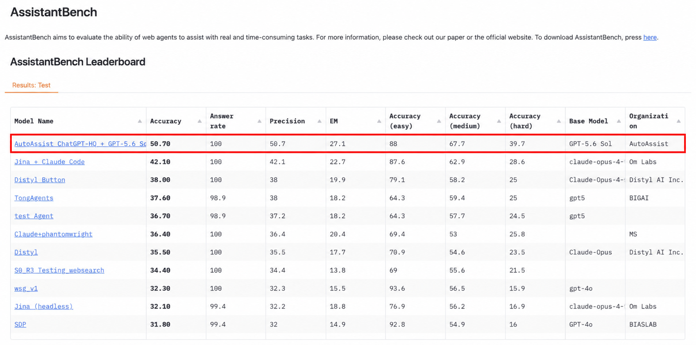
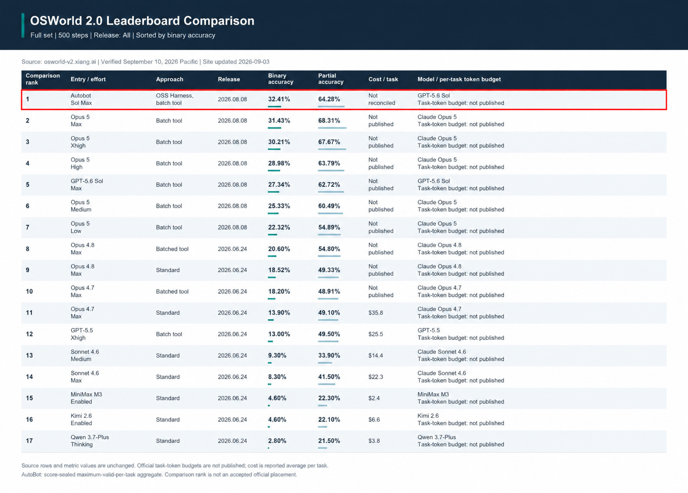

# AutoBot: the self-improving agent harness for ChatGPT and Codex

AutoBot is an open-source (MIT) agent harness that loads into a ChatGPT or Codex local Project on your Mac. It adds on-disk memory, privacy zones and an independent completion validator, and ranks #1 on the AssistantBench leaderboard.

[](#setup-and-installation)

<!-- AUTOBOT:RELEASE:START -->
**Current release:** [AutoBot v0.5.0](https://github.com/demeyer1/Autobot/releases/tag/v0.5.0). [Download and verify the release](https://github.com/demeyer1/Autobot/releases/tag/v0.5.0).
<!-- AUTOBOT:RELEASE:END -->

| Benchmark | AutoBot result | Comparison |
| --- | ---: | --- |
| [AssistantBench](https://github.com/demeyer1/Autobot/blob/main/benchmarks/assistantbench/README.md) | **50.70%**, #1 recorded official hidden-test result | 181 tasks, 100% answer rate |
| [OSWorld 2.0](https://github.com/demeyer1/Autobot/blob/main/benchmarks/osworld-2.0/README.md) | **32.41%** binary accuracy | GPT-5.6 Sol Max 27.34%; Claude Opus 5 Max 31.43% |

**Paste this into Codex:**

> Install AutoBot from https://github.com/demeyer1/Autobot, following INSTALL_FOR_AI.md. Verify the latest release ZIP and its manifest, install it, and guide me through selecting the installed folder as my local Project's primary folder. Include support software needed for first-time setup from official sources. Bring me in for any Mac or account step I need to do.

OpenAI’s Dots work from their own cloud computer. AutoBot runs inside your own ChatGPT or Codex Project on your Mac, with memory you can read and edit.

AutoBot turns difficult workflows into durable upgrades. It can repair its operating harness, independently validate the change, and carry the improvement into the next task. Hierarchical memory lives on disk, task-specific retrieval builds the working context, and persistent checkpoints let a replacement worker resume an interrupted assignment.

Open source. Native ChatGPT and Codex on your Mac. Built by [Autonomous Production](https://autoprod.ai).

Formerly AutoAssist.

## Benchmarks

### AssistantBench

**#1 on the recorded official hidden-test leaderboard: 50.70% accuracy across 181 tasks.**



[Results and verification](https://github.com/demeyer1/Autobot/blob/main/benchmarks/assistantbench/README.md)

### OSWorld 2.0

**32.41% binary accuracy and 64.28% partial accuracy across 108 tasks.** Final best-valid-per-task aggregate, compared with the published September 10, 2026 leaderboard snapshot.

On OSWorld 2.0 (release 2026.08.08, all 108 tasks), AutoBot with GPT-5.6 Sol Max reached 32.41% binary accuracy in a self-run evaluation: 18.5% above the official GPT-5.6 Sol Max result (27.34%) and above Claude Opus 5 Max (31.43%). Method and verifier are in the benchmark folder.



[Results and methodology](https://github.com/demeyer1/Autobot/blob/main/benchmarks/osworld-2.0/README.md)

## What it changes

- **Privacy by relationship and purpose.** Personal, family and friends, work, and deliberately shared context have separate zones. Nothing moves into `SHARED` automatically.
- **Independent completion.** The local runtime rejects validation under the producer label. The operating contract requires a separate validator to inspect current evidence, including the real destination when the task changes something outside the workspace.
- **Durable follow-through.** Native ChatGPT Goals keep active work moving. AutoBot keeps the objective, stages, evidence, and recovery state on disk so an interrupted chat does not erase the commitment.
- **Clean external actions.** Recipient-visible writes use the signed-in first-party app through Computer Use. The operating contract requires account, destination, and content checks before the action, followed by rendered result verification.
- **Tone that stays in its lane.** Communication profiles remain separate by channel and audience. AutoBot stores compact, user-approved patterns rather than raw message archives by default.

## What AutoBot includes

AutoBot combines two layers:

1. **Native ChatGPT and Codex:** the desktop app, local Projects, Voice, Goals, skills and plugins, scheduled work, notifications, and Computer Use.
2. **The AutoBot workspace:** the operating contract in `AGENTS.md`, privacy zones, selective memory, project status, a local objective state machine, a one-minute liveness supervisor, external-action policy, and first-time setup.

AutoBot is an agent harness, not a separate model, chatbot, or agent gateway. It depends on current ChatGPT and Codex capabilities and their plan, region, usage, sandbox, and permission limits. See [Architecture](docs/ARCHITECTURE.md) and [Permissions](docs/PERMISSIONS.md).

## AutoBot compared with Dots, OpenClaw and Hermes

| Dimension | AutoBot | OpenAI Dots | OpenClaw | Hermes Agent |
| --- | --- | --- | --- | --- |
| Where it runs | Inside a local ChatGPT or Codex Project on your Mac | In an OpenAI cloud computer, with optional handoffs to a connected local computer | In a separately operated gateway on your own host or server | In a separately operated local or server runtime |
| Plans and regions | Uses the ChatGPT or Codex features available to the signed-in account | Pro 100/200/500 outside the EEA, UK and Switzerland; Business Premium and administrator-enabled Enterprise worldwide, subject to rollout | Open source; model, channel and hosting availability depend on the operator | Open source; model, channel and hosting availability depend on the operator |
| Inspectable, editable memory | Plain files in the Project, with relationship and purpose zones | Dot memory and task context managed by ChatGPT | Workspace files, memory files and optional memory services | Curated memory, user profiles and session search |
| Completion verification | Ordered evidence stages plus a validator label separate from the producer, with destination readback for external work | The dot can create, inspect and steer delegated tasks; no equivalent AutoBot validator contract is documented | Durable task state, audit tools and extensible workflows | Tool approvals, execution controls and extensible workflows |
| Published benchmarks | AssistantBench and OSWorld 2.0 results with evidence and verifiers | No directly comparable harness benchmark published in the cited product documentation | No directly comparable harness benchmark published in the cited primary sources | No directly comparable harness benchmark published in the cited primary sources |

These are product-boundary differences, not guarantees of accuracy, speed, security, or reliability. AutoBot’s privacy zones and validator separation are procedures within one Mac account. They are not OS isolation or cryptographic identities. Read the [detailed OpenClaw and Hermes comparison](docs/COMPARISON.md) and [AutoBot vs OpenAI Dots](docs/autobot-vs-openai-dots.md).

<!-- AUTOBOT:WHATS-NEW:START -->
## What’s new in v0.5.0

Six portable skills now ship with each installation: Slack inbox triage, Messages inbox triage, Finish the Mission, Remember and Improve, AutoBot Health Check, and Delegate and Verify. Managed skill installation preserves user customizations and global skills, checks each project-local projection, and supports verified upgrade and rollback.
<!-- AUTOBOT:WHATS-NEW:END -->

## Privacy zones

| Zone | Intended context | Default boundary |
| --- | --- | --- |
| `PRIVATE` | Sensitive personal facts, preferences, health, finances, and private plans | Never shared automatically |
| `FAMILY_FRIENDS` | Relationships, events, logistics, and authorized personal communication patterns | Never used for work without a current explicit need |
| `WORK` | Organizations, projects, teammates, customers, vendors, and professional communication patterns | Never used for personal communication unless explicitly relevant |
| `SHARED` | The minimum facts you deliberately make reusable across zones | Opt-in only, with provenance |

These are owner-only folders and operating rules inside one macOS account. They are not separate encrypted vaults, macOS users, or hardware security boundaries. Use separate macOS accounts or machines when the trust domains require stronger isolation. Read [Privacy](PRIVACY.md).

## Completion that requires evidence

Each durable objective moves through five ordered stages:

1. `research_complete`
2. `draft_complete`
3. `destination_updated`
4. `save_confirmed`
5. `rendered_readback_verified`

The local runtime enforces stage order, evidence hashes, and a validator label different from the producer label. The operating contract requires a separate validator to use fresh evidence and inspect the authoritative destination for external work.

This is procedural independence on one Mac, not a separate security enclave. AutoBot cannot bypass a login, MFA, macOS permission, plan limit, user decision, or the scope of the user’s instruction. The supervisor records liveness and flags stalled objectives. It does not create permission to continue.

## No-attribution, fail-closed writes

AutoBot treats connectors, apps, MCP tools, browser integrations, and APIs as read-only unless a destination-specific adapter proves the same clean-write properties. Recipient-visible writes normally use the signed-in first-party interface through native ChatGPT Computer Use.

Before a live write, the operating contract requires the active ChatGPT workflow to check the app, account, destination, scope, and final visible content. Afterward, the workflow must inspect the rendered result and check for the intended mutation, no duplicate, no failure, and no added AI or ChatGPT attribution. If a platform forces a non-removable label or the result is ambiguous, the workflow cannot claim success.

That policy cannot remove immutable metadata or disclosures controlled by a third-party platform. Details: [Security](SECURITY.md).

## Native Voice and long-running work

[ChatGPT Voice](https://learn.chatgpt.com/docs/features/voice) can start separate threads for longer tasks, check them, send follow-ups, and bring progress or blockers back into the voice conversation. [Goal mode](https://learn.chatgpt.com/docs/long-running-work) keeps the outcome and completion criteria attached to the work.

Important limits:

- Voice availability, usage, and rollout depend on the ChatGPT plan and workspace.
- Only one voice chat can be active across desktop at a time.
- Tasks started from Voice also use the Codex usage budget.
- Starting a Goal does not broaden sandbox access or approval authority.

## Commands

```zsh
./runtime/bin/autobot doctor
./runtime/bin/autobot version
./runtime/bin/autobot core status
./runtime/bin/autobot core help
```

The legacy `autoassist` command remains available for existing installations. Run `./runtime/bin/autobot help` for the complete local command list.

`privacy-scan` is a clean release-candidate check, not a post-install scan of a populated user workspace. Run it only before user configuration or against a separate clean release tree.

## FAQ

### What is an AI agent harness?

An agent harness supplies the operating rules, memory, tools, state and verification around a model. AutoBot adds those controls to a native ChatGPT or Codex local Project instead of replacing the host with another agent interface.

### How do I add persistent memory to ChatGPT or Codex on a Mac?

AutoBot stores canonical context in readable Project files and retrieves only the parts relevant to the current task. The user can inspect, edit or remove that memory with ordinary local tools.

### What is the difference between AutoBot and OpenAI Dots?

Dots operate from an OpenAI cloud computer and can delegate to connected computers. AutoBot runs in a local Project on the user’s Mac and keeps its operating contract, memory and completion evidence in that Project. See [AutoBot vs OpenAI Dots](docs/autobot-vs-openai-dots.md).

### Is AutoBot an OpenClaw alternative?

AutoBot can address some of the same long-running agent needs, but it keeps ChatGPT or Codex as the user interface. OpenClaw is a separate gateway with its own channels, runtime and deployment model.

### How does AutoBot verify that an AI task is complete?

It records ordered evidence stages, rejects validation under the producer label, and requires fresh destination readback for external work. The validator contract makes a worker’s unsupported “done” report insufficient.

### Does AutoBot keep my data private?

AutoBot keeps its workspace and memory files local by default and separates context by relationship and purpose. Content can still leave the Mac when the user sends it to ChatGPT, a connected service, or an external destination. Read [Privacy](PRIVACY.md) for the exact boundary.

## Read next

- [Install](#setup-and-installation)
- [Permissions](docs/PERMISSIONS.md)
- [Capabilities and availability](docs/CAPABILITIES.md)
- [Architecture](docs/ARCHITECTURE.md)
- [Local runtime reference](docs/CLI-REFERENCE.md)
- [Privacy](PRIVACY.md)
- [Security](SECURITY.md)
- [AutoBot vs OpenClaw and Hermes Agent](docs/COMPARISON.md)
- [AutoBot vs OpenAI Dots](docs/autobot-vs-openai-dots.md)
- [Troubleshooting](docs/TROUBLESHOOTING.md)

## Current status

AutoBot is an early public release for a single user on a Mac. The package is not a multi-tenant service, an OS sandbox, a cryptographic privacy boundary, or a guarantee that every third-party action will succeed. Treat a downloadable ZIP as verified only when its checksum and manifest match the adjacent release artifacts and the packaged candidate passes the bundled release checks.

## License

AutoBot is available under the [MIT License](LICENSE). Copyright (c) 2026 AutoBot contributors.

## Setup and installation

Install AutoBot on the Mac that hosts your local Project, then continue from your phone with Remote and Voice.

1. **Open Codex on your Mac.** [Get the desktop app](https://learn.chatgpt.com/docs/app), sign in, and start a local Project called AutoBot in an empty setup folder.
2. **Ask Codex to install AutoBot.** Paste the install prompt near the top of this page.
3. **Try it locally.** When prompted, choose **Edit project > Add folder**, select the installed `AutoAssist` folder, and choose **Make primary**. Start a fresh task there: “Run first-time setup for this installed folder. Then make and save a sample checklist, and open it for me.”

The `AutoAssist` folder name is retained so existing local Projects keep their path. Codex handles the download and verification in the guided route. If you prefer to do that yourself, use the [manual installation guide](docs/INSTALL.md).

### Phone and always-on Mac setup

On the Mac, open ChatGPT and sign in to the same account and workspace you use on your phone. Go to **Settings → Connections → Control this Mac or PC → Set up/Add**, scan the QR code in the ChatGPT phone app, and enable **Keep this Mac awake**; leave the Mac plugged in and online. On your phone, open [Remote](https://learn.chatgpt.com/docs/remote-connections) and start or continue the AutoBot Codex chat using [Voice](https://help.openai.com/en/articles/20001275-chatgpt-work-and-codex). Ask a read-only question about a detail in the local Project to confirm the connection.

### Supercharge AutoBot

- **Work in apps:** add [Computer Use and app permissions](docs/PERMISSIONS.md) for the apps you choose.
- **Connect your accounts:** add email, calendar or other [available capabilities](docs/CAPABILITIES.md) one at a time.

Review [privacy](PRIVACY.md) and [security](SECURITY.md) before connecting sensitive accounts. Keep authentication and recovery codes on a separate device. For upgrades, repair, removal or a paused setup, use the [installation guide](docs/INSTALL.md) or ask AutoBot to continue first-time setup from its saved progress.

## First magic moments

### Make AutoBot sound like me

**Step 0: Connect your messages once.** Tell AutoBot, “Connect my work email and Messages on this Mac.” Complete any sign-in or Mac permissions, then approve a few messages you wrote as examples.

1. **Load AutoBot by voice.** On your phone, open **Remote**, choose your AutoBot chat, start Voice, and say: “Load AutoBot.”
2. **Teach it your styles.** Say: “Learn how I write to colleagues and how I text friends. Keep the styles separate and show me how each sounds.”
3. **Hear the difference.** Review the two short style summaries and sample drafts. Correct anything that sounds off, then approve the profiles. AutoBot stores compact, separate style patterns by default.

### Connect my calendar and prep me for the day

**Step 0: Connect your calendar once.** Tell AutoBot, “Install my work calendar connector.” Complete its sign-in and have AutoBot confirm it can see upcoming events.

1. **Load AutoBot by voice.** On your phone, open **Remote**, choose your AutoBot chat, start Voice, and say: “Load AutoBot.”
2. **Hand off the day.** Say: “Get me ready for my next workday, and keep working after I end Voice.”
3. **Get on with your day.** Once AutoBot confirms a supported long-running task is active, end Voice. When it finishes, AutoBot brings you a brief with your meetings, open time, and what to prepare, with anything uncertain flagged.
