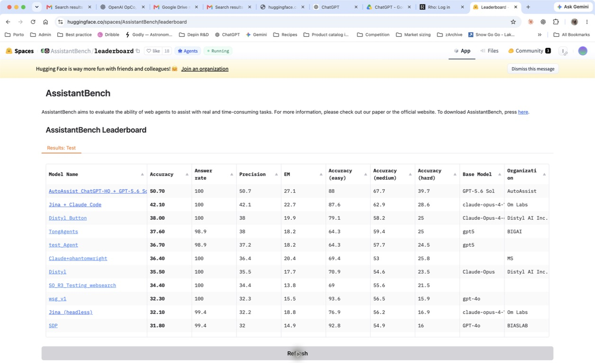

# AssistantBench

At the September 2, 2026 verification, Autobot ChatGPT-HQ + GPT-5.6 Sol Ultra ranked **#1** on the official AssistantBench test leaderboard. It scored **50.70% accuracy** with a **100.0% answer rate** across all 181 hidden-test tasks.

- Official score: **50.70% accuracy**
- Official position: **#1**
- Coverage: **181/181 hidden-test tasks**
- Answer rate: **100.0%**

The result was produced by Autobot's custom research harness and scored by the official AssistantBench hidden evaluator. [Open the live leaderboard](https://huggingface.co/spaces/AssistantBench/leaderboard). New submissions may require clicking the leaderboard's **Refresh** control before they appear.

Verification details

- Precision: **50.7%**
- Exact match: **27.1%**
- Easy accuracy: **88.0%**
- Medium accuracy: **67.7%**
- Hard accuracy: **39.7%**
- Missing or nonterminal answers: **0**
- Submission artifact SHA-256: `af99212a3c5b5045705fcd6f6b762642257447796ca85b6923e6f11906a97991`
- Submission identity SHA-256: `94d234df96c44c182c1d8a0309ce65f35b2c7cd6e011ea99d0e8880c4dce0085`

The first UI attempt exposed a path-safety problem in the model-name metadata. We fixed the metadata guard, reran the live collision and artifact checks, and submitted the unchanged verified 181-row artifact under the corrected model name. Hidden-test answers are not published.

[Back to Autobot](../../README.md)
