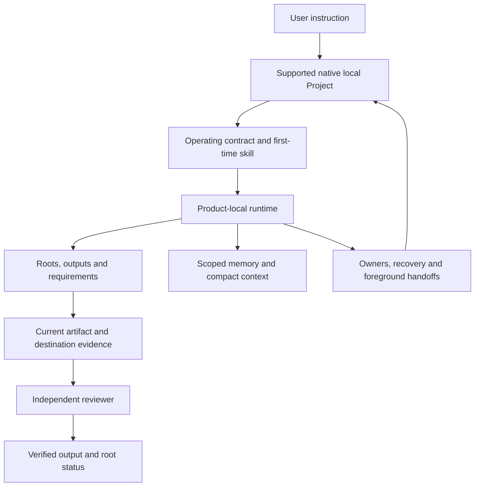

# Architecture

Autobot adds durable local state to the user's native ChatGPT or Codex workflow. The native app reasons and acts. The local runtime tracks what was requested, what remains owed and which current evidence supports completion.

## One local work store

The v0.2 runtime uses a product-local store with roots, outputs, attempts, requirement dependencies and intent revisions. A correction invalidates incompatible old support. A completed child cannot complete an unfinished root. Legacy v0.1 objective data is imported through a defined compatibility path rather than left as a competing writable ledger.

State writes use exclusive ownership and atomic persistence. Checkpoints contain concrete progress and a resume point. Repeated unchanged failures require a new hypothesis; they cannot create an endless retry loop or a made-up user gate.

## Evidence and acceptance

The five stages remain research, draft, destination update, persistence and rendered readback. Evidence binds to the current output, attempt, intent and bytes. Requirement coverage and dependencies must be supported. Changed content, wrong targets or stale attempts invalidate prior judgments.

Producer and validator labels must differ, but labels are not cryptographic identities. The coordinator must arrange a truly separate reviewer and fresh authoritative destination inspection. The CLI enforces local consistency. It does not automatically intercept all native assistant responses or prove that a reviewer exercised sound judgment.

Local proof reuse is for unchanged local research or drafts. It never replaces fresh external delivery/readback evidence.

## Context and privacy

The workspace retains a compact memory map and four purpose-specific zones. Memory records carry provenance, retention and assignment. Corrections supersede old active facts. Compact context is derived from scoped sources and falls back safely when stale or invalid.

Zones are operating-policy boundaries within one trusted macOS account. They are not separate encrypted vaults or OS users. The package starts with empty user stores and has no inherited accounts, recipients, schedules or spending permissions.

## Recovery and optional scheduling

A local tick can retain liveness, missing-owner and pending-handoff state. It never launches a model, controls the UI or sends a message. Foreground work uses one owner; an uncertain outcome requires destination reconciliation before retry. Outbound targets are unset by default.

Native Goals and schedules remain optional app capabilities with their own account, availability, usage and machine requirements. Discover and test them instead of assuming them from a configuration flag. [Native schedules](https://learn.chatgpt.com/docs/automations)

## Installation boundary

The shell entry point installs the local folder without requiring Node or sign-in. The advanced runtime uses Node 22+ and built-in modules; no npm dependency or model API is configured. Missing runtime readiness is explicit and cannot activate a broken service.

Upgrades preserve user state and customized product files through original/current/new comparison. A target-only quiescence step and transaction checks guard the handoff. Project-local first-time discovery avoids overwriting unrelated global skills. Rollback and uninstall use receipt-bound resources.

## Limits

Autobot assumes one trusted user and does not defend against a malicious process with that user's filesystem access. It does not bypass authentication, platform approvals, TCC, plan limits or changed third-party interfaces. It does not guarantee continuity through power loss or native app termination. Release privacy scanning is bounded and supplemented by independent semantic and media review.

See [Capabilities](CAPABILITIES.md), [Security](../SECURITY.md), [Privacy](../PRIVACY.md) and the release validation report for the exact implemented and tested boundary. [Local Projects](https://learn.chatgpt.com/docs/projects) provide the native folder context; Autobot does not turn a web project into local filesystem access.
